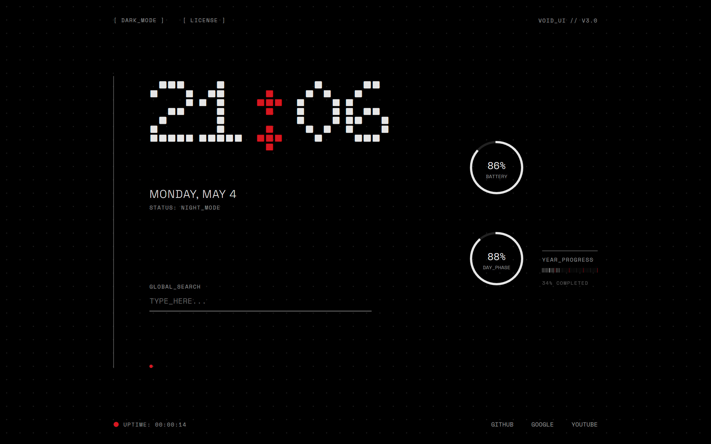
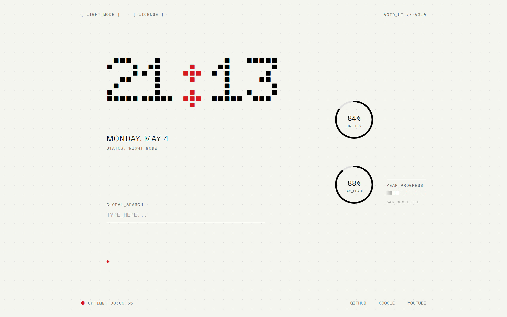

# VOID // GLYPH New Tab

**Step into the "VOID UI" every time you open a new tab.**

VOID // GLYPH is a high-fidelity, industrial New Tab extension inspired by the Nothing OS design system. Transform your browser into a sleek, monochromatic control center with high-density system monitoring.

Experience a seamless interface where every widget updates at a high frequency of 100ms, making your browser feel alive and precise.

## 🛠 Features

- **High-Definition Digital Clock**: Featuring custom dot-matrix typography (Doto) for a bold, minimalist look.
- **Real-Time System Widgets**:
    - **BATTERY**: Monitor your device's power levels at a glance.
    - **DAY_PHASE**: Visualize the progression of your current day.
    - **YEAR_PROGRESS**: Track the year's progress through a unique segmented bar.
- **Session Uptime**: A live counter showing how long your current tab has been active (100ms precision).
- **Light / Dark Mode**: Instantly toggle between a warm off-white and a deep industrial black.
- **Global Search**: A centered, distraction-free search bar that respects your default search provider.

## 🚀 Installation (Manual)

1. Download or clone this repository.
2. Open Chrome and navigate to `chrome://extensions/`.
3. Enable **Developer mode** (toggle in the top right).
4. Click **Load unpacked** and select the folder containing these files.

## 🔒 Privacy

- **Ultra-Lightweight**: Optimized for speed. No bloat, no lag.
- **Ad-Free**: A completely clean experience designed for focus.
- **Transparency**: Uses Google Fonts for UI display; no other external communication.

## 📝 License

This project is for personal use and design exploration. Inspired by the Nothing OS design language.
